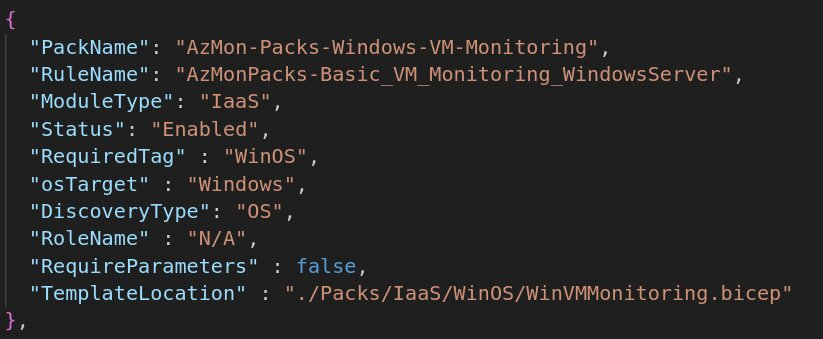

# Pack Authoring

## Pack Structure

A pack is composed of the following components:
DCRs - Data Collection Rules
Policies - Policies to assign the DCRs to the VMs
Alerts
Workbooks/Grafana Dashboards

### Details

## Packs.json structure

PackName - Pack name
RuleName - Name of the DCR to be created in Azure
ModuleType - IaaS is the only supported type
Status - Enabled/Disabled. Defines whether the pack will be installed or not during setup
RequiredTag - Tag that will be used to assign the DCR to the VMs
TemplateLocation - file path to the main bicep file for that pack. The file must be in the Packs folder.