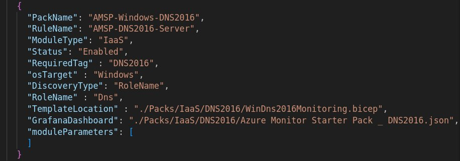
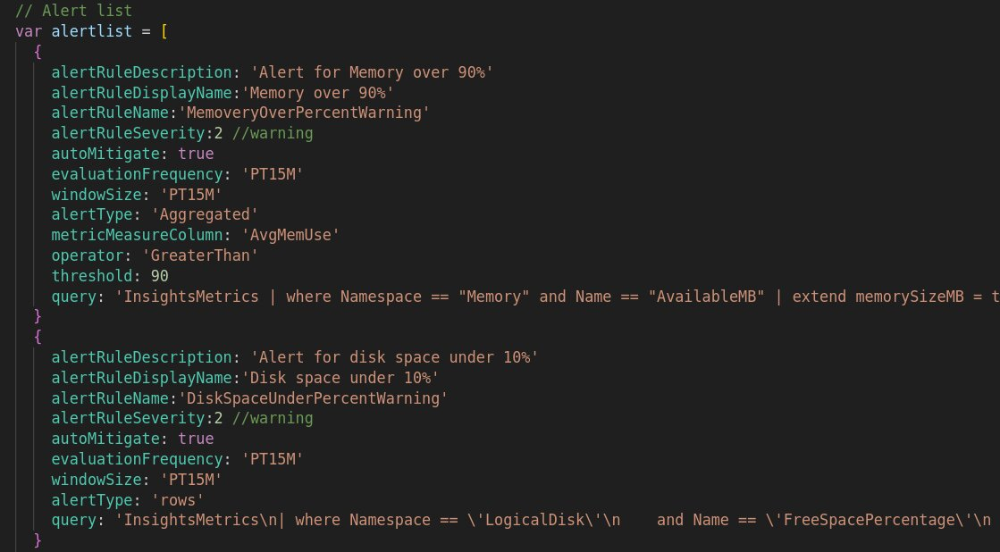
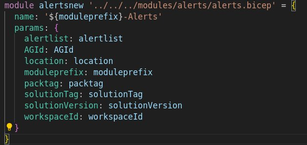

# Pack Authoring

## Pack Structure

A pack is composed of the following components:
DCRs - Data Collection Rules
Policies - Policies to assign the DCRs to the VMs
Alerts
Workbooks/Grafana Dashboards

### Details

## Packs.json structure

PackName - Pack name
RuleName - Name of the DCR to be created in Azure
ModuleType - IaaS is the only supported type
Status - Enabled/Disabled. Defines whether the pack will be installed or not during setup
RequiredTag - Tag that will be used to assign the DCR to the VMs
TemplateLocation - file path to the main bicep file for that pack. The file must be in the Packs folder.
GrafanaDashaboard - location of the Grafana dashboard json file to be imported during setup.

### DCR/Policy Templates

#### VMInsights template

- [`/modules/DCRs/DefaultVMI-rule.bicep`](../modules/DCRs/DefaultVMI-rule.bicep) (Win/Linux)

#### Basic VM DCR (events and performance)

- [`modules/DCRs/dcr-basicWinVM.bicep`](../modules/DCRs/dcr-basicWinVM.bicep) (Windows)
- [`modules/DCRs/dcr-basicLinuxVM.bicep`](../modules/DCRs/dcr-basicLinuxVM.bicep) (Linux) 

#### Basic File ans syslog (Linux)

- [`modules/DCRs/filecollectionSyslogLinux.bicep`](../modules/DCRs/filecollectionSyslogLinux.bicep) (Linux)

### Alert Templates

To use basic alert templates, you need an array of alert definitions. For example:

Alerts can be of two types:
`Aggregate` : based on an aggregated metric as above, lik AvgMemUse; or
`rows`: based on the number of rows returned being more than 0.

#### Calling the alerts template:

Once the alerts list is created, use the definition example below to create the alerts:

### File structure examples

