# Azure Monitor Starter Packs Components

## Pre-requisites

- Azure Subscription - an azure subscription to deploy the components
- Log Analytics Workspace - a Log Analytics Workspace to send the data to. If not provided, a workspace will be requested. If required a new workspace can be created in the wizard.

## Agent Configuration

The agent install is done by assigning a custom initiative that will install the agent and configure it to send data to the provided workspace. During Setup, the initiative will be assigned to the subscription and all the VMs in the subscription will be targeted. The initiative will be assigned to new VMs as they are created. Remediation can be done after once the backend components are deployed (via workbook).

## Azure Workbook

Central admin interface for the solution. The workbook is used to enable/disable packs and to manage the solution.
  
## Tabs

### Getting Started
  
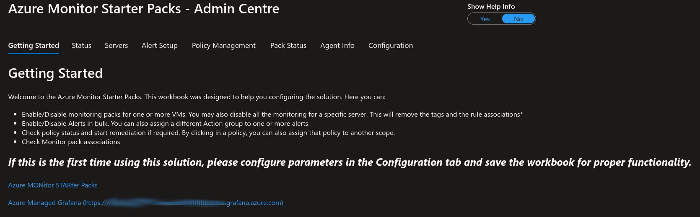

### Status
  Used to review the status of the solution.
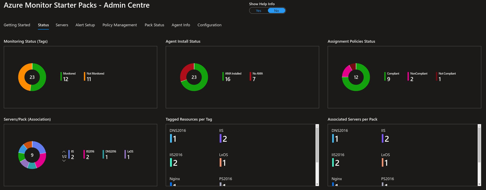

### Servers (IaaS)
  Used to enable or disable monitoring for one or more servers.
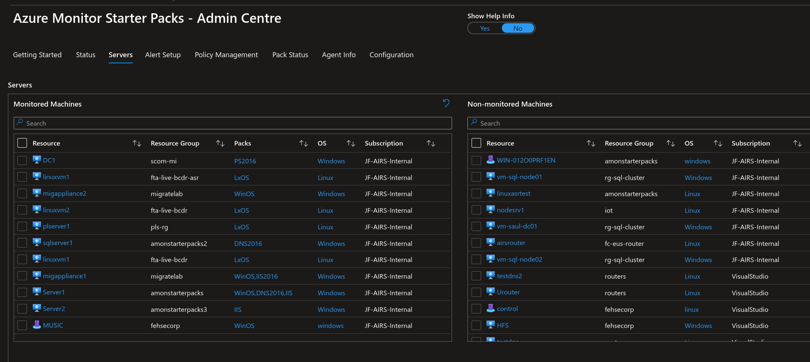
When a server is selected, the list of available packs is offered:
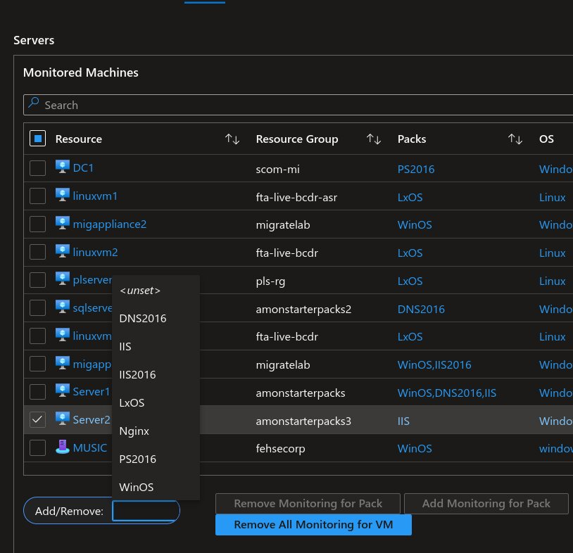

### PaaS

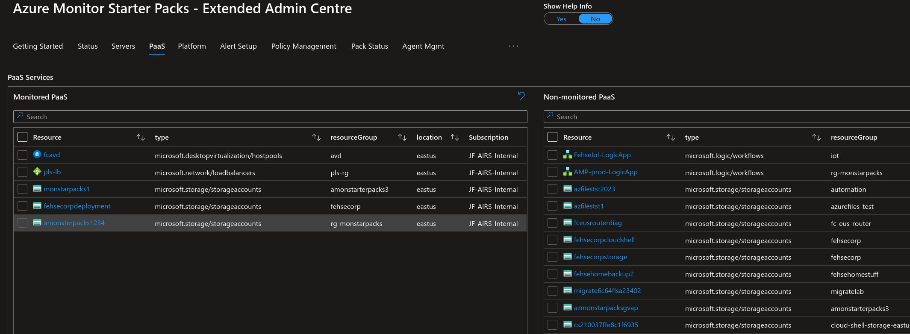

### Platform

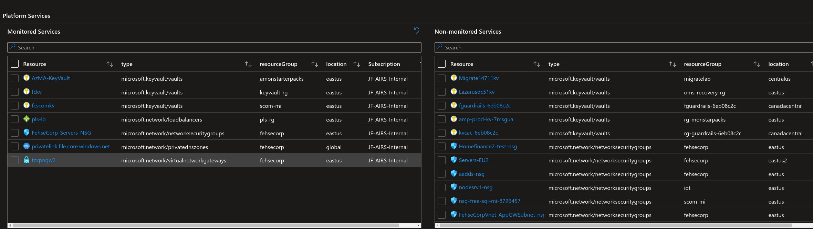

### Alert Setup
  Used to enable or disable alerts per monitoring pack, as well as to Configure the action group to the alerts. The solution can also delete the alert rule if required.

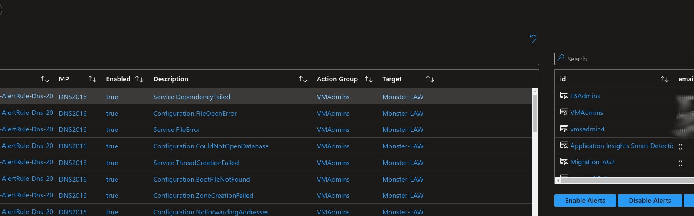

### Policy Management
  General policy status (initiatives and policies). This tab can also be used to assign or unassign policies to management groups or subscriptions.
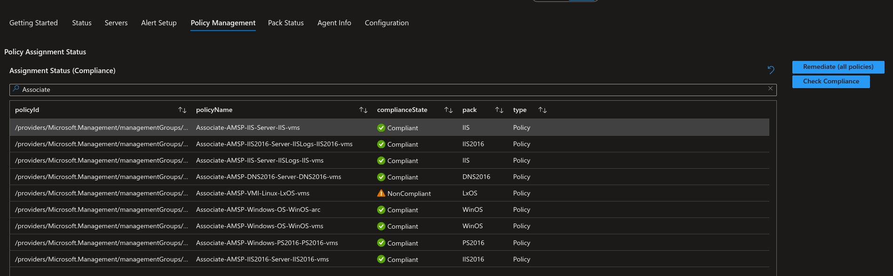
- Pack Status - Review installed packs and VMs associated with each pack.
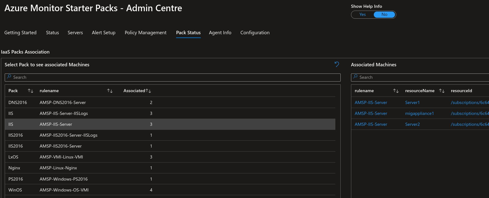
- Agent Info - Review agent status (installed or not).
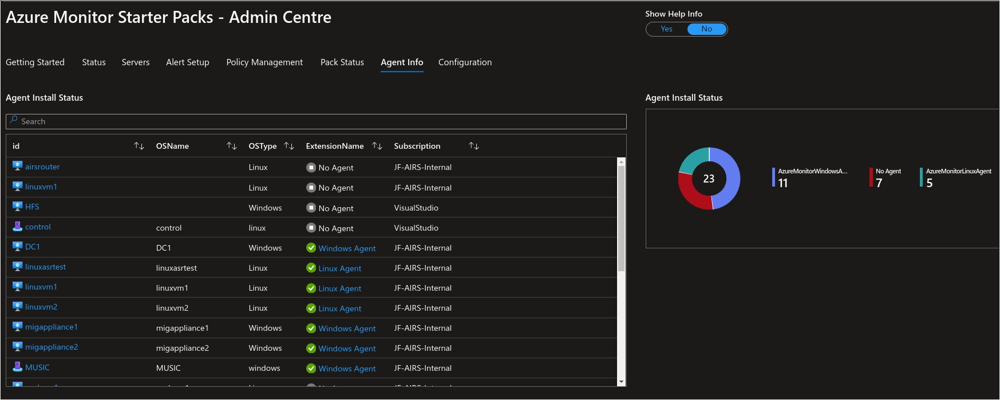

## Discovery

## Packs

Packs are in general composed of:

- Data Collection Rule(s) - responsible for collecting the data from the VMs
- Policies - responsible for assigning the DCRs to the VMs (based on tags)
- Alerts - responsible for alerting on the collected data
- Data Collection Endpoints - responsible for sending the data to the Log Analytics Workspace for specific packs that require file collection or syslog.
- Grafana Dashboards - used to visualize the data collected by the DCRs
- VM Application - used to collect additional data from the VMs (if required).
- Action Groups - although not part of the pack per se, the action group is required for notification. The action group can be created during setup and can be used for all packs or a different one can be used for each pack.

### AMA Policy Set (Initative)

The AMA Policy Set is an initiative that contains all the policies required for installing the Azure Monitor Agent. The initiative is assigned to the subscription or Management group during setup. The initiative contains the following Builtin policies:

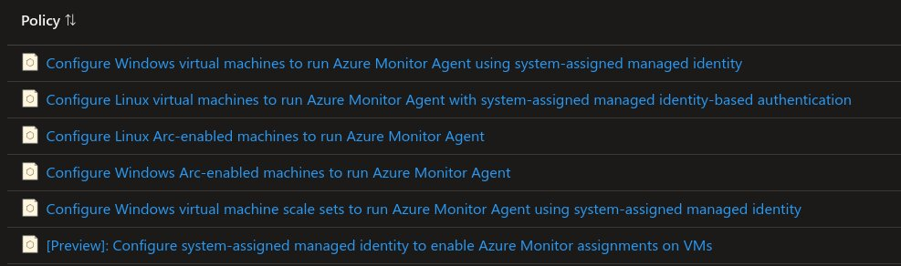

Basic Solution Components (Backend)

The basic solution is composed of the following components:

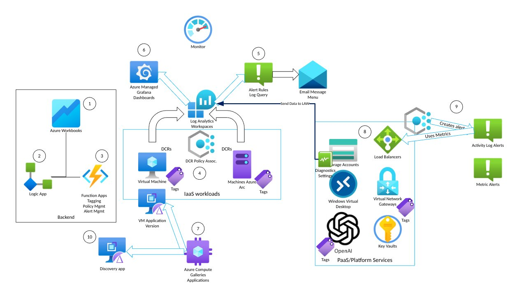

1. The admin workbook is used to enable/disable monitoring (tags), enabling/disabling alerts and reconfigure action groups and to manage policies (remediate, evaluate and re-assign).

2. The logic app is triggered by the workbook ARM actions and determine which function to call (policymgmt, alertmanagement or tagmgmt) to perform the appropriate actions.

3. The function apps execute the actions as per above. The tagmgmt function also installs AMA if not present.

4. Once tagging is detected by a specific policy, a DCR association is created between the pack specific rule and the targeted VM(s).

5. Alerts Rules are mostly Scheduled query alerts and run on specific schedules, generating the specified alerts.

6. Azure Managed Grafana has dashboards created to provide a rich experience to the customers.

7. For Discovery of workloads, a VM Application is deployed to Azure VMs to generate the discovery data and DCR collects the data, which is shown in the Admin Workbook. VM Applications can be also used by packs that require richer data.

8. For PaaS and platform services, when tagged, policies will generate the required alerts following the guidance from the AMBA documentation.

9. For PaaS and platform services, Alerts are usually created by the policies themselves. Policies can, if required, deploy diagnostics settings, which will send data to the log analytics workspace.

10. The discovery component leverages a VM Application and a DCR to collect installed applications in Windows and Linux. The data is added to a custom table in the Log Analytics workspace and can be used to help onboarding discovered workloads.