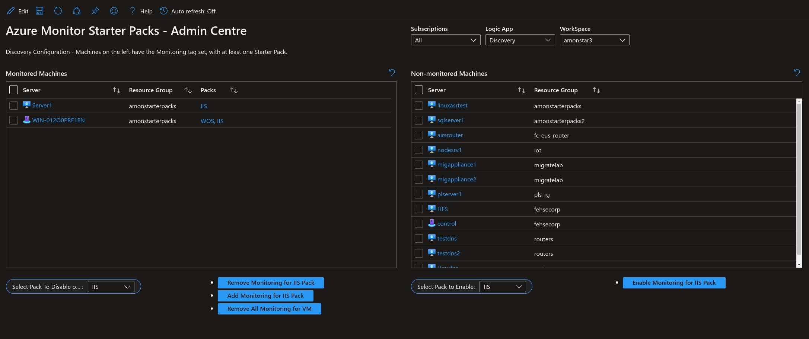
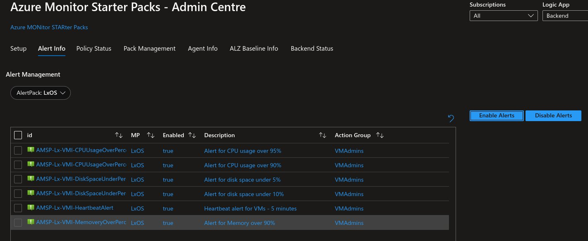
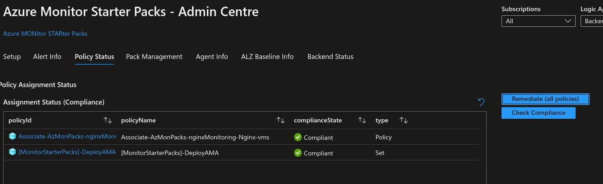
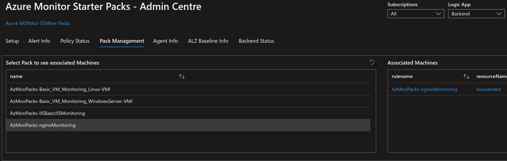
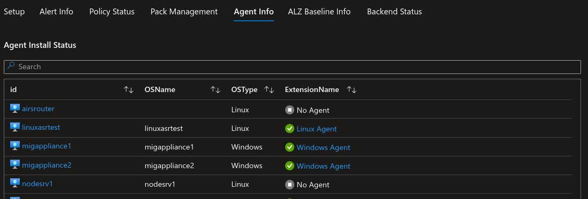
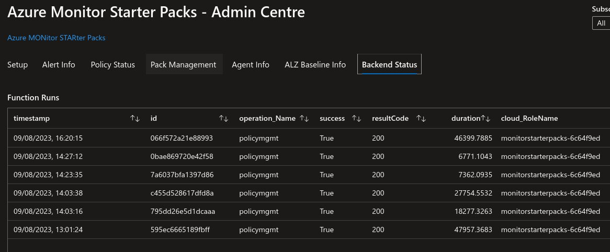

# Azure Monitor Starter Packs Components

## Pre-requisites

- Azure Subscription - an azure subscription to deploy the components
- Log Analytics Workspace - a Log Analytics Workspace to send the data to. If not provided, a workspace will be requested. If required a new workspace can be created in the wizard.

## Agent Configuration

The agent install is done by assigning a custom initiative that will install the agent and configure it to send data to the provided workspace. During Setup, the initiative will be assigned to the subscription and all the VMs in the subscription will be targeted. The initiative will be assigned to new VMs as they are created. Remediation can be done after once the backend components are deployed (via workbook).

## Basic Solution Components (Backend)

The basic solution is composed of the following components:

- Azure Workbook - Central admin interface for the solution. The workbook is used to enable/disable packs and to manage the solution.
  
  Tabs:
  - Setup - used to enable or disable tags for one or more VMs.
  
  - Alert Info - used to enable or disable alerts per monitoring pack.

  - Policy Status - general policy status (initiatives and policies).
  
  - Pack Management - Review installed packs and VMs associated with each pack.
  
  - Agent Info - Review agent status (installed or not).
- 
  - ALZ Baseline Info - future integration with ALZ monitoring.
  - Backend Status - Function logs.

- Azure Logic App - responsible for routing requests coming from the workbook to the proper function in the function app.
- Function app - resposible fore the following activities
    - Alert Management - enable/disable alerts
    - Policy Management - scan for compliance and remediate
    - Tag management - add/remove tags to/from VMs.
- Application Insights - used by the function app for logging and telemetry.
- Storage Account - supporting the function app.

## Packs

Packs are in general composed of:
- Data Collection Rule(s) - responsible for collecting the data from the VMs
- Policies - responsible for assigning the DCRs to the VMs (based on tags)
- Alerts - responsible for alerting on the collected data
- Data Collection Endpoints - responsible for sending the data to the Log Analytics Workspace for specific packs that require file collection or syslog.
- Action Groups - although not part of the pack, the action group is required for notification. The action group is created during setup and can be used for all packs or a different one can be used for each pack.
- 