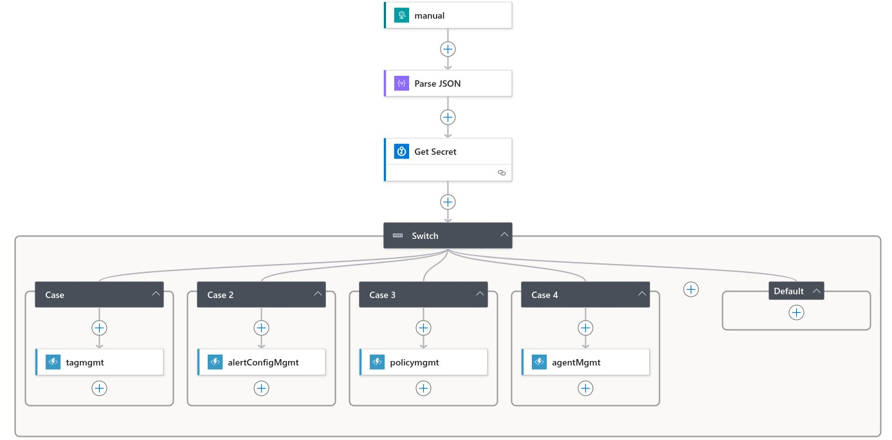

# Azure Monitor Starter Packs Components

## Pre-requisites

- Azure Subscription - an azure subscription to deploy the components
- Log Analytics Workspace - a Log Analytics Workspace to send the data to. If not provided, a workspace will be requested. If required a new workspace can be created in the wizard.

## Agent Configuration

The agent install is done by assigning a custom initiative that will install the agent and configure it to send data to the provided workspace. During Setup, the initiative will be assigned to the subscription and all the VMs in the subscription will be targeted. The initiative will be assigned to new VMs as they are created. Remediation can be done after once the backend components are deployed (via workbook).

## Azure Workbook

Central admin interface for the solution. The workbook is used to enable/disable packs and to manage the solution.
  
## Tabs

### Getting Started
  

### Status
  Used to review the status of the solution.

### Servers (IaaS)
  Used to enable or disable monitoring for one or more servers.

When a server is selected, the list of available packs is offered:

### PaaS

### Platform

### Alert Setup
  Used to enable or disable alerts per monitoring pack, as well as to Configure the action group to the alerts. The solution can also delete the alert rule if required.

## Discovery (Virtual Machines only)

Discovery works by installing a small script to VMs (Windows and Linux) and collecting information about installed applications and roles.

This information is collected by a data collection rule and analysed by the function. The results are exposed in the Workbook, offering the option to enable to proper packs if wanted.

## Packs

Packs are in general composed of:

- Data Collection Rule(s) - responsible for collecting the data from the VMs
- Alerts - responsible for alerting on the collected data
- Data Collection Endpoints - responsible for sending the data to the Log Analytics Workspace for specific packs that require file collection or syslog.
- Grafana Dashboards - used to visualize the data collected by the DCRs
- VM Application - used to collect additional data from the VMs (if required).
- Action Groups - although not part of the pack per se, the action group is required for notification. The action group can be created during setup and can be used for all packs or a different one can be used for each pack.

### Basic Solution Components (Backend)

The basic solution is composed of the following components:

<!-- ...existing code... -->
### Basic Solution Components (Backend)

The basic solution is composed of the following components:

*   The **admin workbook** is used to enable/disable monitoring (tags), enabling/disabling alerts, reconfigure action groups, and manage policies (remediate, evaluate, and re-assign).
*   The **logic app** is triggered by the workbook ARM actions and determines which function to call (`packmgmt`, `alertmanagement`, `config`) to perform the appropriate actions.
*   The **function apps** execute the actions as per above. The `packmgmt` function also installs the Azure Monitor Agent (AMA) if not present.
*   **Alert Rules** are mostly Scheduled Query Alerts and run on specific schedules, generating the specified alerts.
*   **Azure Managed Grafana** has dashboards created to provide a rich experience to the customers.
*   For **Discovery** of workloads, a VM Application is deployed to Azure VMs to generate the discovery data, and a Data Collection Rule (DCR) collects the data, which is shown in the Admin Workbook. VM Applications can also be used by packs that require richer data.
*   For other **Azure services**, the required alerts will be created by the function following the guidance from the AMBA documentation.
*   The **discovery component** leverages a VM Application and a DCR to collect installed applications in Windows and Linux. The data is added to a custom table in the Log Analytics workspace and can be used to help onboard discovered workloads.