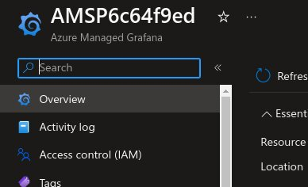
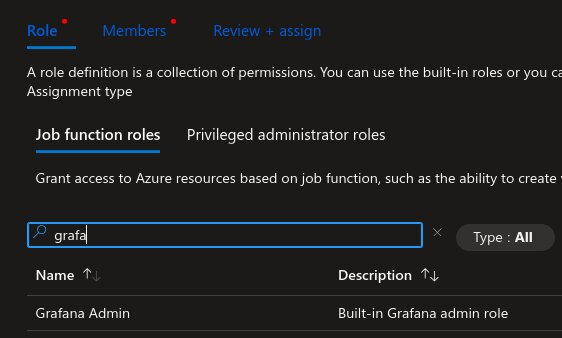

# FastTrack for Azure - Monitoring Starter Packs (MonStar Packs)

## Objectives

- Minimize the initial ramp up required for customers, in multiple aspects of the Azure technologies to deploy basic monitoring.

- Minimize the need for the Customer tto determine the minimal monitoring items for a certain type of workload 

- Provide best practices out of the box on items that need monitoring for different workloads 

- Create a framework for collaboration that will make it easy to add new monitored technologies. 

For a detailed solution anatomy, please refer to [Solution Anatomy](./Docs/solution-anatomy.md)

## Pre-requisites and recommendations

- Azure Subscription - an Azure subscription to deploy the components
- A Management group structure with at least one management group. Most of the elements like policies and permissions need to be deployed at a management group level.

## Setup

The Main solution can be deployed by clicking the link below.

## Starter Packs

Packs can also be deployed individually or all at the same time.

Review Packs documentation [here](./Packs/README.md).

## Grafana Dashboards

Each pack may have its own Grafana dashboard. The Grafana dashboards are deploying along with each pack.
In order for the current user to have access to the Grafana environment, the user needs to be added to the Grafana Admins group. This can be done by running the following these instructions.

1. Navigate the recently deployed Grafana environment and click on Access Control (IAM) and click on Add role assignment.

2. Select the proper user or users. The process may take a few minutes to assign the proper permissions.

## Authoring Guide

Click [here](./Docs/authoring.md) for guidance on how to create new packs.

## Contributing

This project welcomes contributions and suggestions.  Most contributions require you to agree to a
Contributor License Agreement (CLA) declaring that you have the right to, and actually do, grant us
the rights to use your contribution. For details, visit https://cla.opensource.microsoft.com.

When you submit a pull request, a CLA bot will automatically determine whether you need to provide
a CLA and decorate the PR appropriately (e.g., status check, comment). Simply follow the instructions
provided by the bot. You will only need to do this once across all repos using our CLA.

This project has adopted the [Microsoft Open Source Code of Conduct](https://opensource.microsoft.com/codeofconduct/).
For more information see the [Code of Conduct FAQ](https://opensource.microsoft.com/codeofconduct/faq/) or
contact [opencode@microsoft.com](mailto:opencode@microsoft.com) with any additional questions or comments.

## Trademarks

This project may contain trademarks or logos for projects, products, or services. Authorized use of Microsoft 
trademarks or logos is subject to and must follow 
[Microsoft's Trademark & Brand Guidelines](https://www.microsoft.com/en-us/legal/intellectualproperty/trademarks/usage/general).
Use of Microsoft trademarks or logos in modified versions of this project must not cause confusion or imply Microsoft sponsorship.
Any use of third-party trademarks or logos are subject to those third-party's policies.
