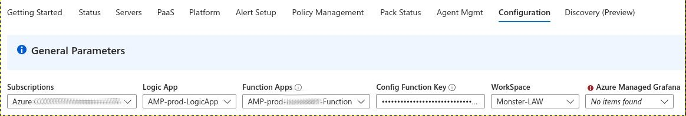

# Monitoring Starter Packs (MonStar Packs)

# V3 (Public Preview)

## Objectives

- Minimize the initial ramp up required for customers, in multiple aspects of the Azure technologies to deploy basic monitoring.

- Minimize the need for the Customer to determine the minimal monitoring items for a certain type of workload 

- Provide best practices out of the box on items that need monitoring for different workloads. The Monitoring Packs work closely wit the Azure Monitor Baseline Alerts [AMBA](http://aka.ms/amba) and the Azure Monitor teams to provide an comprehensive and aligned monitoring solution.

- Create a framework for collaboration that will make it easy to add new monitored technologies. 

For a detailed solution anatomy, please refer to [Solution Anatomy](./Docs/solution-anatomy.md)

## What is new in V3 (Preview)

- No dependency on policies
- Flexible Discovery
- Quicker deployment
- No management group requirement
- Easy Pack authoring

## Pre-requisites and recommendations

- Azure Subscription - an Azure subscription to deploy the components
- An Azure subscription with Owner permissions.

## Setup

The Main solution can be deployed by clicking the link below to the respective cloud.

[](https://portal.azure.com/#blade/Microsoft_Azure_CreateUIDef/CustomDeploymentBlade/uri/https%3A%2F%2Fraw.githubusercontent.com%2FFehseCorp%2FAzureMonitorStarterPacks%2Frefs%2Fheads%2Fmain%2Fsetup%2FCustomSetup%2Fmonstar.json/uiFormDefinitionUri/https%3A%2F%2Fraw.githubusercontent.com%2FFehseCorp%2FAzureMonitorStarterPacks%2Frefs%2Fheads%2Fmain%2Fsetup%2FCustomSetup%2Fsetup.json)

## Initial Configuration

Once the deployment is completed, the following steps need to be completed:

- Navigate to the recently deployed resource group and find the workbook name "Azure Monitor Starter Packs Extended". Open the workbook and click on the "Configuration" tab. This will open a new tab with the configuration page.



Once the parameters are configured, make sure to save the workbook.

The first time certain areas are accessed, the following configuration will need to be accepted:


## Monitoring Packs

The IaaS packs are deployed along with the main solution. The Services packs are deployed when needed, directly from the AMBA website API.

Review Packs documentation [here](./Packs/README.md).

## Multi-region Considerations

If you are deploying the solution in multiple regions, a few additional steps are required. The following steps need to be completed:
- For discovery and VM Application dependent components (ADDS), the VM Application versions need to have a replica in each region where VMs will be monitored.
- For the Data Collection rules, a data collection endpoint needs to be created in each region. The data collection endpoint allows for the agent to receive configuration in the specific region. The data collection endpoint is assigned after the data collection rule association has been created.

## Grafana Dashboards

Each pack may have its own Grafana dashboard. The Grafana dashboards are deployed as a package during the packs deployment. Using Grafana is optional but will limit the visuazliation capabilities of the solution.
In order for the current user to have access to the Grafana environment, the user needs to be added to the Grafana Admins group. This can be done by running the following these instructions.

1. Navigate the recently deployed Grafana environment and click on Access Control (IAM) and click on Add role assignment.


2. Select the proper user or users. The process may take a few minutes to assign the proper permissions.

## Network Isolation (Private Endpoints)

Review Network Isolation guidance [here](./Docs/networkisolation.md).

## Removing the solution

The solution can be removed by simply removing the components in the resource group. However, it is recommended to remove the monitoring in the solution to remove tags and VM applications from the resources (if any).

Removing the components won't remove VM applications, tags and extentions from VMs and Arc Servers. It is recommended to disable the monitoring on the interface if a complete remove is desired.

Note: The Azure Managed Grafana environment requires about 10 minutes to be removed. Once finished, the resource group can be removed.

Note 2: To completeley remove the Log Analytics workspace, use the -ForceDelete parameter. This will remove the workspace and all the data in it (ignoring the retention period).

Example:

```powershell
remove-AzOperationalInsightsWorkspace -ResourceGroupName <Resource Group> -Name <Workspace name> -ForceDelete -force
```

## Telemetry

Microsoft can correlate these resources used to support the deployments. Microsoft collects this information to provide the best experiences with their products and to operate their business. The telemetry is collected through customer usage attribution. The data is collected and governed by Microsoft's privacy policies, located at https://www.microsoft.com/trustcenter.

If you don't wish to send usage data to Microsoft, you can disable telemetry during setup. 

Project Bicep collects telemetry in some scenarios as part of improving the product.


## Authoring Guide

Click [here](./Docs/authoring.md) for guidance on how to create new packs.

## Telemetry

Microsoft can correlate these resources used to support the deployments. Microsoft collects this information to provide the best experiences with their products and to operate their business. The telemetry is collected through customer usage attribution. The data is collected and governed by Microsoft's privacy policies, located at https://www.microsoft.com/trustcenter.

If you don't wish to send usage data to Microsoft, you can disable telemetry during setup. 

Project Bicep collects telemetry in some scenarios as part of improving the product.

## Contributing

This project welcomes contributions and suggestions.  Most contributions require you to agree to a
Contributor License Agreement (CLA) declaring that you have the right to, and actually do, grant us
the rights to use your contribution. For details, visit https://cla.opensource.microsoft.com.

When you submit a pull request, a CLA bot will automatically determine whether you need to provide
a CLA and decorate the PR appropriately (e.g., status check, comment). Simply follow the instructions
provided by the bot. You will only need to do this once across all repos using our CLA.

This project has adopted the [Microsoft Open Source Code of Conduct](https://opensource.microsoft.com/codeofconduct/).
For more information see the [Code of Conduct FAQ](https://opensource.microsoft.com/codeofconduct/faq/) or
contact [opencode@microsoft.com](mailto:opencode@microsoft.com) with any additional questions or comments.

## Trademarks

This project may contain trademarks or logos for projects, products, or services. Authorized use of Microsoft 
trademarks or logos is subject to and must follow 
[Microsoft's Trademark & Brand Guidelines](https://www.microsoft.com/en-us/legal/intellectualproperty/trademarks/usage/general).
Use of Microsoft trademarks or logos in modified versions of this project must not cause confusion or imply Microsoft sponsorship.
Any use of third-party trademarks or logos are subject to those third-party's policies.
