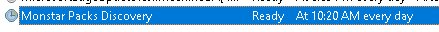

# Discovery

## Overview

The automatic discovery process is a process that leverages the Compute Gallery and VM Applications to deliver a discovery script to each server targetted by the Monitoring packs for Windows (WinOS) and Linux (LxOS).
Once a machine is targetted, a VM Application is deployed to the VM. For Windows, the the application is composed of a powershell script and a scheduled task. For Linux, the application is composed of a bash script and a cron job.
The script is responsible for collecting the information from the machine and sending it to the Log Analytics workspace.
Once the data is collected, it can be analyzed and used to determine which packs are required to monitor the machine.

## Windows Discovery

For Windows a scheduled task as below is created:

The script is deployed to the `C:\WindowsAzure\Discovery` folder. The script is called discovery.ps1 and is executed by the scheduled task.
It rans on a daily basis and creates two files:
- installedAppsWMI.csv - Contains the list of installed applications on the machine
- installedFeatures.csv - Contains the list of installed features on the machine (Roles and Features)

## Linux Discovery

The script is deployed to `/opt/microsoft/discovery` folder. The script is called discovery.sh and is executed by the root cron job.
It runs on a daily basis and creates one file:
`/opt/microsoft/discovery/discoveredapps.csv` - Contains the list of installed applications on the machine.
